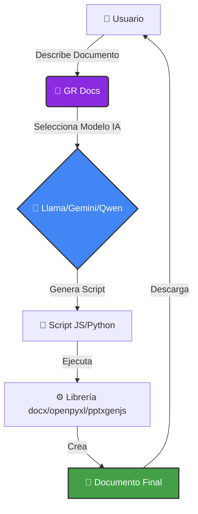
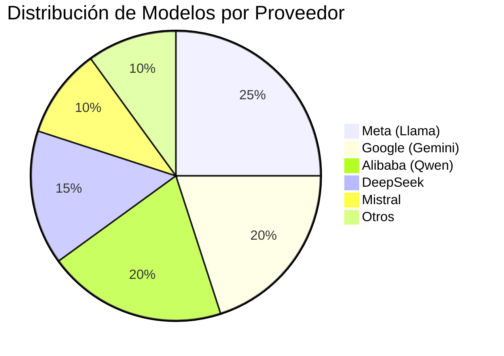

<table>
<tr>
<td width="150">

</td>
<td>
<h1>GR Docs</h1>
<em>"Tu Generador de Documentos Profesionales Impulsado por IA"</em>
</td>
</tr>
</table>


---

## 📋 Tabla de Contenidos

- [Sobre GR Docs](#-sobre-gr-docs)
- [Características](#-características-destacadas)
- [Flujo de Trabajo](#-flujo-de-trabajo)
- [Instalación](#️-instalación-y-configuración)
- [Uso](#-cómo-usar-gr-docs)
- [Modelos Disponibles](#-modelos-de-ia-disponibles)
- [Estructura del Proyecto](#-estructura-del-proyecto)
- [Solución de Problemas](#-solución-de-problemas)
- [Licencia](#-licencia)

---

## 💡 Sobre GR Docs

**GR Docs** es un **generador de documentos profesionales** que utiliza **Inteligencia Artificial** para crear archivos **Word**, **Excel**, **PowerPoint** y **PDF** de forma automática.

> [!NOTE]
> GR Docs utiliza modelos de IA avanzados para generar código que crea documentos profesionales. No es un simple template, ¡es un generador inteligente!

Gracias a **Llama, Gemini, Qwen y otros modelos de IA**, puedes:

* 📝 Generar **documentos Word** con formato profesional usando `docx`
* 📊 Crear **hojas de cálculo Excel** con fórmulas y gráficos usando `openpyxl`
* 🎨 Diseñar **presentaciones PowerPoint** con layouts variados usando `pptxgenjs`
* 🤖 Personalizar el **contenido y estilo** mediante lenguaje natural
* ⚡ Ejecutar todo desde la **línea de comandos** o **API REST**

> [!TIP]
> Puedes usar GR Docs tanto en modo local (interactivo) como en modo API (para integraciones).

---

## 🔄 Flujo de Trabajo



---

## ✨ Características Destacadas

| ⚡ Funcionalidad | 📌 Detalle |
| --- | --- |
| **Generación Inteligente** | Describe lo que necesitas y la IA genera el código automáticamente |
| **Multi-formato** | Word (.docx), Excel (.xlsx), PowerPoint (.pptx) |
| **Personalización Total** | Colores, estilos, tablas, gráficos, todo configurable |
| **Ejecución Automática** | Los scripts se ejecutan y generan el documento final |
| **Modo Local e API** | Usa desde terminal o integra en tus aplicaciones vía REST API |
| **Múltiples Modelos IA** | Llama, Gemini, Qwen, DeepSeek, Mistral y más vía OpenRouter |
| **Manejo de Errores** | Detección automática de rate limits y errores con sugerencias |

> [!IMPORTANT]
> GR Docs requiere una API key de OpenRouter para funcionar. Hay muchos modelos completamente gratuitos disponibles.

---

## 🎨 Badges & Estado


---

## ⚙️ Instalación y Configuración

> [!WARNING]
> Asegúrate de tener Python 3.8+ y Node.js 14+ instalados antes de continuar.

### 1️⃣ Clonar el Repositorio

```bash
git clone https://github.com/grcodedigitalsolutions/GR_Docs.git
cd GR_Docs
```

### 2️⃣ Crear Entorno Virtual

```bash
python -m venv venv
source venv/bin/activate  # Linux/Mac
# o
venv\Scripts\activate  # Windows
```

### 3️⃣ Instalar Dependencias Python

```bash
pip install -r requirements.txt
```

> [!NOTE]
> Si no existe `requirements.txt`, instala manualmente:
> ```bash
> pip install pyyaml colorama requests openpyxl
> ```

### 4️⃣ Instalar Dependencias Node.js

```bash
npm install
```

Esto instalará:
- `docx` - Para generar documentos Word
- `pptxgenjs` - Para generar presentaciones PowerPoint

---

### 5️⃣ Configurar la API Key

Para que **GR Docs** funcione necesitas una **API key de OpenRouter**.

| Servicio | Badge | Pasos para generar la API |
| --- | --- | --- |
| **OpenRouter** |  | 1. Ve a [OpenRouter Keys](https://openrouter.ai/settings/keys)<br>2. Inicia sesión o crea una cuenta<br>3. Genera tu API key<br>4. **Hay modelos gratuitos disponibles** sin necesidad de pago |

> [!TIP]
> OpenRouter te da acceso a múltiples modelos de IA (Claude, Gemini, Llama, etc.) con una sola API key. Muchos modelos son completamente gratuitos.

#### 📝 Crear el archivo `.env`

**Opción 1: Usando echo (Linux/Mac)**

```bash
echo "TU_API_KEY_AQUI" > .env
```

**Opción 2: Usando un editor**

```bash
# Con nano
nano .env

# Con vim
vim .env

# Con VS Code
code .env
```

Luego pega tu API key y guarda el archivo.

**Opción 3: Copiar desde plantilla**

```bash
# Crear archivo .env con tu API key
cat > .env << EOF
sk-or-v1-tu-api-key-aqui
EOF
```

#### ✅ Verificar la Configuración

```bash
# Verificar que el archivo existe
ls -la .env

# Ver los primeros caracteres (sin mostrar la key completa)
head -c 20 .env && echo "..."
```

**Salida esperada:**
```
sk-or-v1-1234567890...
```

> [!CAUTION]
> **NUNCA** compartas tu API key ni la subas a GitHub. El archivo `.env` ya está en `.gitignore`.

---

## 🧠 Modelos de IA Disponibles

GR Docs soporta múltiples modelos de IA a través de OpenRouter:



<details>
<summary><strong>👇 Ver Lista Completa de Modelos Soportados</strong></summary>

<br>

> [!NOTE]
> Todos estos modelos están disponibles a través de **OpenRouter** con una sola API key.

---

### 🟣 Meta – Llama (Recomendado para uso gratuito)

[](#)
[](#)

> [!TIP]
> Llama 3.3 70B es gratuito y ofrece excelente calidad para generar documentos.

---

### 🔵 Google – Gemini

[](#)
[](#)
[](#)

---

### � Alibaba – Qwen

[](#)
[](#)

---

### � DeepSeek

[](#)
[](#)

---

### 🔵 Mistral

[](#)
[](#)

---

### � Anthropic – Claude (Requiere créditos)

[](#)
[](#)

> [!WARNING]
> Los modelos de Claude requieren créditos en OpenRouter, no son gratuitos.

---

</details>

### 🔧 Configurar Modelo

Edita `settings.yaml` para cambiar el modelo:

```yaml
# AI model (use list_models.py to see available free models)
model: meta-llama/llama-3.3-70b-instruct:free
```

> [!NOTE]
> Puedes usar cualquier modelo disponible en OpenRouter. Los modelos con `:free` al final son completamente gratuitos.

Para ver todos los modelos gratuitos disponibles:

```bash
python list_models.py
```

---

## 🚀 Cómo Usar GR Docs

### 📝 Modo Local (Interactivo)

```bash
python main.py -m local
```

o simplemente:

```bash
python local.py
```

Esto abrirá un menú interactivo:

```
╔════════════════════════════════════════════════════════════════╗
║              GR DOCS - GENERADOR DE DOCUMENTOS                 ║
╚════════════════════════════════════════════════════════════════╝

Selecciona qué deseas generar:

  1. Documento Word (.docx)
  2. Archivo Excel (.xlsx)
  3. Presentación PowerPoint (.pptx)
  4. Todos

Opción (1/2/3/4):
```

### 🌐 Modo API (Servidor)

```bash
python main.py -m api
```

Esto iniciará un servidor FastAPI en `http://localhost:8000`

> [!NOTE]
> El modo API permite integrar GR Docs en tus aplicaciones. Ver [API_EXAMPLES.md](API_EXAMPLES.md) para documentación completa.

**Endpoints disponibles:**
- `GET /` - Información de la API
- `GET /health` - Estado del servidor
- `POST /docx` - Generar documento Word
- `POST /xlsx` - Generar archivo Excel
- `POST /pptx` - Generar presentación PowerPoint

**Ejemplo rápido:**
```bash
curl -X POST http://localhost:8000/docx \
  -H "Content-Type: application/json" \
  -d '{"request":"Informe de ventas Q1 2024","download":true,"send_file":true}' \
  --output informe.docx
```

---

## 📚 Ejemplos de Uso

### Ejemplo 1: Generar Documento Word

```bash
python local.py
# Selecciona opción 1
# Describe: "Informe de ventas Q1 2024 con tablas y gráficos"
```

**Resultado:** `doc/cache/output/informe-ventas-q1-2024.docx`

### Ejemplo 2: Generar Excel

```bash
python local.py
# Selecciona opción 2
# Describe: "Control de inventario con fórmulas y formato condicional"
```

**Resultado:** `xlsx/cache/output/control-inventario.xlsx`

### Ejemplo 3: Generar PowerPoint

```bash
python local.py
# Selecciona opción 3
# Describe: "Presentación sobre Historia del Violín con 12 slides"
```

**Resultado:** `pptx/cache/output/historia-violin.pptx`

---

## 📂 Estructura del Proyecto

```text
GR_DOCS/
├─ assets/              # Recursos (logo, imágenes)
│  └─ logo.png
├─ doc/                 # Generador de Word
│  ├─ cache/           # Scripts y outputs generados
│  │  ├─ *.mjs         # Scripts JavaScript generados
│  │  └─ output/       # Documentos .docx finales
│  ├─ prompt.gr        # Prompt para generación de Word
│  └─ word.py          # Clase WordScriptGenerator
├─ xlsx/                # Generador de Excel
│  ├─ cache/           # Scripts y outputs generados
│  │  ├─ *.py          # Scripts Python generados
│  │  └─ output/       # Archivos .xlsx finales
│  ├─ prompt.gr        # Prompt para generación de Excel
│  └─ excel.py         # Clase ExcelScriptGenerator
├─ pptx/                # Generador de PowerPoint
│  ├─ cache/           # Scripts y outputs generados
│  │  ├─ *.cjs         # Scripts CommonJS generados
│  │  └─ output/       # Presentaciones .pptx finales
│  ├─ prompt.gr        # Prompt para generación de PowerPoint
│  └─ powerpoint.py    # Clase PowerPointScriptGenerator
├─ licenses/            # Licencias en múltiples idiomas
│  ├─ LICENSE_ES       # Español
│  ├─ LICENSE_EN       # English
│  ├─ LICENSE_DE       # Deutsch
│  ├─ LICENSE_FR       # Français
│  └─ LICENSE_PT       # Português
├─ venv/                # Entorno virtual Python
├─ node_modules/        # Dependencias Node.js
├─ .env                 # API key (NO SUBIR A GIT)
├─ .gitignore           # Archivos ignorados
├─ settings.yaml        # Configuración principal
├─ main.py              # Punto de entrada principal
├─ local.py             # Modo interactivo
├─ server.py            # Modo API
├─ list_models.py       # Listar modelos disponibles
├─ package.json         # Dependencias Node.js
├─ requirements.txt     # Dependencias Python
└─ README.md            # Este archivo
```

---

## 🛠️ Solución de Problemas

### ❌ Error: "API key no configurada"

> [!WARNING]
> Verifica que el archivo `.env` exista en la raíz del proyecto y contenga tu API key.

```bash
# Verificar que existe
ls -la .env

# Verificar el contenido (sin mostrar la key completa)
head -c 20 .env && echo "..."

# Si no existe, créalo
echo "sk-or-v1-tu-api-key-aqui" > .env
```

**Formato correcto del `.env`:**
```
sk-or-v1-1234567890abcdef...
```

**Formato INCORRECTO:**
```
API_KEY=sk-or-v1-...  ❌ (No uses variables)
"sk-or-v1-..."        ❌ (No uses comillas)
sk-or-v1-... \n       ❌ (No dejes espacios o saltos de línea)
```

> [!TIP]
> El archivo `.env` debe contener **solo la API key**, sin `API_KEY=`, sin comillas, sin espacios extras.

### ❌ Error: "Node.js no está instalado"

```bash
# Verifica la instalación
node --version
npm --version

# Si no está instalado:
# Ubuntu/Debian
sudo apt install nodejs npm

# macOS
brew install node
```

### ❌ Error: "Cannot find module 'docx'"

```bash
# Reinstala las dependencias
npm install
```

### ❌ Error: "No module named 'openpyxl'"

```bash
# Activa el entorno virtual
source venv/bin/activate

# Instala openpyxl
pip install openpyxl
```

### ❌ El modelo genera código con errores

> [!TIP]
> Algunos modelos gratuitos pueden generar código de menor calidad. Prueba con Llama 3.3 70B o Gemini 2.0 Flash para mejores resultados gratuitos.

---

## 🗺️ Roadmap

- [x] Soporte para Word (.docx)
- [x] Soporte para Excel (.xlsx)
- [x] Soporte para PowerPoint (.pptx)
- [x] Modo interactivo (local)
- [ ] Soporte para PDF
- [ ] API REST completa
- [ ] Interfaz web
- [ ] Plantillas predefinidas
- [ ] Soporte para imágenes en documentos
- [ ] Generación de gráficos avanzados

---

## 💌 Contribuciones

Las contribuciones son bienvenidas. Por favor:

1. Fork el proyecto
2. Crea una rama para tu feature (`git checkout -b feature/AmazingFeature`)
3. Commit tus cambios (`git commit -m 'Add some AmazingFeature'`)
4. Push a la rama (`git push origin feature/AmazingFeature`)
5. Abre un Pull Request

---

## 📎 Recursos

* [Documentación de docx](https://docx.js.org/)
* [Documentación de openpyxl](https://openpyxl.readthedocs.io/)
* [Documentación de pptxgenjs](https://gitbrent.github.io/PptxGenJS/)
* [OpenRouter API](https://openrouter.ai/docs)
* [OpenRouter Models](https://openrouter.ai/models)

---

## 🏆 Créditos

**GR Code Digital Solutions** – Equipo de desarrollo y mantenimiento.

💻 Creado para hacer que la generación de documentos sea simple y poderosa.

---

## 💙 Apoya El Proyecto

<div align="center">

Si este proyecto te ha sido útil, considera apoyarlo a través de **GitHub Sponsors**.  
Tu contribución ayuda a mantener el desarrollo activo y mejorar futuras versiones.

</div>

---

<div align="center">


<p style="font-size: 22px; font-weight: 800; margin: 0;">JoseEduardoGR</p>

<p>
<strong>Desarrollador • Python • C++ • Node</strong><br/>
🚀 Avanza aunque duela, cada salto te acerca a la versión que nadie creía posible.
</p>

<p>
<a href="https://github.com/JoseEduardoGR?tab=followers">⭐ Seguir en GitHub</a>
</p>

<a href="https://github.com/sponsors/JoseEduardoGR">

</a>

</div>

---

## 📄 Licencia

Esta obra está protegida por una **Licencia Personalizada**  
*(Gratuita para uso personal, comercial requiere contacto)*

Puedes consultar las versiones disponibles en su **idioma respectivo**:

- 🇪🇸 [Español](licenses/LICENSE_ES)  
- 🇬🇧 [English](licenses/LICENSE_EN)  
- 🇩🇪 [Deutsch](licenses/LICENSE_DE)  
- 🇫🇷 [Français](licenses/LICENSE_FR)  
- 🇵🇹 [Português](licenses/LICENSE_PT)

> [!IMPORTANT]
> **Uso Personal:** Completamente gratuito  
> **Uso Comercial:** Requiere licencia. Contacta a [gonzalezrosalesjoseeduardo@gmail.com](mailto:gonzalezrosalesjoseeduardo@gmail.com)

---

<div align="center">

**Hecho con ❤️ por GR Code Digital Solutions**

<kbd>Ctrl</kbd> + <kbd>Alt</kbd> + <kbd>Awesome</kbd>

</div>
